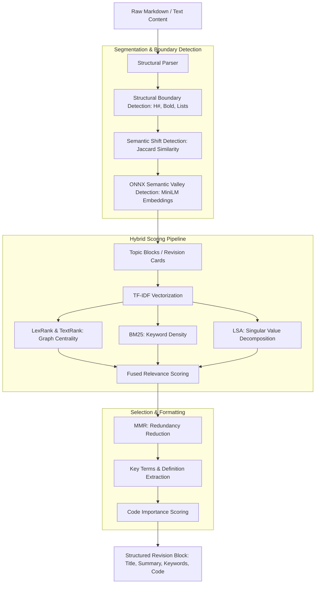

# Deep Technical Overview: Edge AI & Hybrid Intelligence

This document provides an exhaustive technical breakdown of the AI systems powering the **Daily Revision Hub**. The application utilizes a sophisticated multi-layered AI architecture that combines on-device statistical models, vector embeddings, and cloud-based LLMs to deliver intelligent note organization and summarization.

## 1. AI Pipeline Data Flow

The following diagram illustrates the lifecycle of a note as it passes through the multi-stage AI pipeline:

---

## 2. Hybrid AI Architecture Philosophy

The project employs a **Tiered Intelligence Strategy**:

- **Tier 1: Ultra-Fast On-Device Heuristics**: Instant structural parsing of raw text to detect headers, code blocks, and lists.
- **Tier 2: Statistical Edge AI**: A proprietary hybrid summarizer running entirely on the device CPU/NPU, providing 100% privacy and zero-latency analysis.
- **Tier 3: Semantic Edge AI (ONNX)**: Transformer-based embeddings used for semantic boundary detection and topic clustering.
- **Tier 4: Cloud-Scale LLM (Gemini 2.0)**: Optional high-fidelity analysis for complex, unstructured notes using state-of-the-art generative models.

---

## 2. On-Device Summarization Engine (`lib/localSummarizer.ts`)

The core of the offline experience is a custom summarization pipeline that fuses multiple NLP algorithms to extract high-signal content.

### A. The Fused Scoring Pipeline
Each sentence in a document is assigned a "Relevance Score" ($S$) calculated as a weighted linear combination of five distinct signals:

$$S = 0.30 \cdot LexRank + 0.22 \cdot BM25 + 0.18 \cdot TextRank + 0.18 \cdot LSA + 0.12 \cdot Structural$$

1.  **LexRank (Eigenvector Centrality)**:
    - Builds a cosine similarity matrix of TF-IDF vectors.
    - Applies a stochastic matrix transformation to find the most "central" sentences in the document graph.
    - Uses Power Iteration to converge on sentence importance.
2.  **BM25 (Best Matching 25)**:
    - Ranks sentences based on their frequency relative to the top keywords extracted from the document.
    - Incorporates document length normalization to prevent bias toward long sentences.
3.  **TextRank (Graph-based Ranking)**:
    - A variations of PageRank that operates on a sliding window of tokens to identify local semantic clusters.
4.  **LSA (Latent Semantic Analysis)**:
    - Uses Singular Value Decomposition (SVD) and Power Iteration to extract hidden semantic topics and score sentences based on their alignment with these primary topics.
5.  **Structural & Positional Signals**:
    - **Position Scoring**: Boosts lead sentences and conclusion sentences.
    - **Definition Detection**: Uses regex-based signals (`"is a"`, `"refers to"`, etc.) to surface key concepts.
    - **Heading Boost**: High weight given to sentences immediately following a markdown header.

### B. Maximal Marginal Relevance (MMR)
To avoid redundancy, the final sentence selection uses **MMR**. Instead of picking the $K$ highest-scoring sentences, it picks sentences that are high-scoring but *semantically distinct* from those already selected.

---

## 3. Semantic Splitting & Embeddings (`lib/onnxEmbeddings.ts`)

For deeper semantic understanding, the app leverages **ONNX Runtime (React Native)**.

- **Model**: `all-MiniLM-L6-v2` (quantized to ~23MB for mobile efficiency).
- **Execution**: Runs directly on the device using mobile CPU/NPU acceleration.
- **Use Case: Semantic Boundary Detection**:
    - The app computes vector embeddings for every paragraph.
    - It calculates a rolling cosine similarity "valley" detector.
    - When similarity drops significantly below a dynamic threshold (Mean - 0.5 * Std), the system detects a "Topic Shift" and splits the note into a new revision block.

---

## 4. Smart Topic Parsing (`lib/smartTopicParser.ts`)

The parser serves as the "Orchestrator," deciding how to chunk raw data:

- **Structural Splits**: Instant triggers for `#`, `##`, `**Bold Line**`, or `ALL CAPS` lines.
- **Jaccard Similarity Check**: A lightweight statistical check performed before invoking the heavy ONNX model to save battery.
- **Code Block Importance Scoring**:
    - Not all code is equal. The app scores blocks based on:
        - Language (Shell/Bash gets a boost).
        - Pattern Matching (Syscalls, SQL, Imports).
        - Length (Concise snippets favored over boilerplate).
    - Only high-importance code is surfaced in "Study Guides."

---

## 5. Cloud-Scale Intelligence (`lib/aiIntelligence.ts`)

When a Gemini API key is provided, the app can offload complex analysis:

- **Engine**: `gemini-1.5-flash` or `gemini-2.0-flash-lite`.
- **Strategy**: Zero-native-code HTTP implementation.
- **Custom System Prompt**: Optimized for "Academic Organization," turning chaotic notes into structured JSON models with highly descriptive titles and deep-dive summaries.

---

---

## 6. Spaced Repetition Engine: SM-2 Implementation

The "Revision" aspect of the Hub is powered by a custom implementation of the **SuperMemo-2 (SM-2) algorithm**. This governs the adaptive scheduling of revision cards based on user performance.

### The SM-2 Formula
For every topic card, the system maintains three variables:
- **Interval ($I$)**: Days until the next revision.
- **Ease Factor ($EF$)**: Complexity multiplier (default 2.5).
- **Review Count ($n$)**: Number of successful revisions.

When a user rates a card, the system updates these values:

$$EF' = \max(1.3, EF + (0.1 - (5 - q) \cdot (0.08 + (5 - q) \cdot 0.02)))$$
*(Simplified in implementation for mobile performance using discrete rating boosts)*

- **Interval progression**:
  - $I(1) = 1$
  - $I(2) = 6$ (or $3$ in our mobile-optimized variant)
  - $I(n) = I(n-1) \cdot EF$

This ensures that cards the user finds "Hard" appear more frequently, while "Easy" concepts are pushed significantly into the future, optimizing long-term retention.

---

## 7. Data Persistence & Integrity

To ensure zero-data-loss even during complex AI analysis, the app uses a **Dual-Storage Source-of-Truth** strategy:

1.  **FileSystem Source (Primary)**: AI-generated artifacts, summaries, and full note content are stored as JSON files in `FileSystem.documentDirectory`. This avoids the 2MB-6MB limits of `AsyncStorage` and prevents JSON parse hangs.
2.  **Metadata Cache (Secondary)**: Fast-access metadata (streaks, theme settings) is mirrored in `AsyncStorage` for instant UI hydration on startup.
3.  **Atomic Updates**: Every AI extraction result is hashed (DJB2) and checked against the cache before committing to the disk, preventing redundant compute.

---

## 8. Intelligent Feed Orchestration

Beyond raw extraction, the app uses a **Prioritized Interleaving** logic to maximize retention in the home feed:

-   **Priority Weighting**: Topics rated as "Hard" are given a 3x higher appearance frequency.
-   **Interleaving Algorithm**: The feed engine interleaves 1 "Hard" topic for every 2 "Regular/Due" topics using a randomized pointer-sliding approach. This prevents the user from being overwhelmed by difficult content while ensuring it remains top-of-mind.
-   **AI Summarize Mode**: A global state toggle that switches the entire feed from "Reading Mode" (full block content) to "Digestion Mode" (AI summaries). This uses the secondary summarization pipeline to allow quick scanning of thousands of words in seconds.

---

## 9. Technical Performance Metrics

- **Startup Latency**: < 100ms for structural parsing.
- **Local Summarization**: ~300-800ms for a 1,000-word document.
- **Semantic Split (ONNX)**: ~2-4s on modern ARM64 devices (includes embedding generation).
- **Memory Footprint**: ~40-60MB during active ONNX inference (cleaned up immediately after).

---

*Documentation compiled by Rahul Varanasi — v2.2 AI Engine Architecture*
