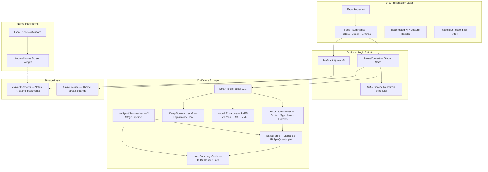

# System Architecture — RVX AI Notes v2

This document provides a high-level overview of the architectural design decisions and data flows powering **RVX AI NOTES** after the v2 ExecuTorch LLM migration.

---

## Core Architecture Philosophy

The application follows an **Offline-First Edge-AI architecture**. All critical AI processing — including LLM inference, text parsing, and database queries — happens directly on the user's device.

### Why Offline-First Edge-AI?
1. **Privacy**: User notes are deeply personal. No text is ever transmitted to a server.
2. **Speed & Availability**: Summaries and topic extractions work without any network.
3. **Cost Efficiency**: No cloud inference API costs — LLM runs locally.
4. **Consent**: The large model (~500MB) is only downloaded when the user explicitly requests it from Settings.

---

## High-Level System Diagram



---

## Component Deep Dive

### 1. UI & Presentation Layer
- **Expo Router v6**: File-based navigation (`app/` directory maps to routes)
- **React Native Reanimated v4**: 60fps gesture-driven animations — shared value worklets keep animations off the JS thread
- **Glassmorphism**: `expo-blur` + `expo-glass-effect` for the premium frosted-glass visual language
- **Typography**: DM Sans + Playfair Display loaded via `@expo-google-fonts`
- **Multi-theme**: `ThemeContext` provides three theme variants (Dark Blue, Midnight Glass, Light Warm)

### 2. Business Logic & State (`context/NotesContext.tsx`)
- **Global state**: folders, notes, bookmarks, streak data, spaced repetition progress
- **SM-2 scheduler**: computes `dueDate` per topic block; powers the algorithmic revision feed
- **`parseTopics()`**: calls the Smart Topic Parser to split notes into revision blocks
- **`generateWholeSummary()`**: triggers the 7-stage Intelligent Summarizer pipeline

### 3. On-Device AI Layer

#### 3a. LLM Engine (`lib/llmSummarizer.ts`)
- Downloads and runs **Llama 3.2 1B SpinQuant** locally via `react-native-executorch`
- Singleton module with status listeners — any component can subscribe to model state
- **Block summarizer**: generates content-type-aware Feynman summaries per revision block
- **Explicit download model**: user must initiate from Settings → stored in device cache

#### 3b. Intelligent Summarizer (`lib/intelligentSummarizer.ts`)
- Produces ONE comprehensive structured summary per entire note (Summaries tab)
- 7-stage pipeline: goal extraction → analysis → typing → architecture → compression → LLM → assembly
- Single LLM call: `maxNewTokens: 512`, ~60–120s regardless of note length

#### 3c. Smart Topic Parser (`lib/smartTopicParser.ts`)
- Multi-signal: hard structural boundaries + Jaccard semantic shift + tech entity dictionary
- 30+ tech vocabulary anchors (Docker, K8s, Terraform, AWS, Git, SQL, Python, etc.)
- v2.2 features: continuation phrase detection, inline splitting for dense LLM-pasted notes

#### 3d. Hybrid Extractive Engine (`lib/localSummarizer.ts`)
- Pure TypeScript — zero native dependencies
- Fuses: BM25 + LexRank (eigenvector centrality) + TextRank + LSA (SVD) with MMR selection
- Runs in ~300–800ms; used for feed card previews and as LLM fallback

#### 3e. Deep Summarizer (`lib/deepSummarizer.ts`)
- v2 teacher-style explanation engine for extractive path
- Classifies each sentence by logical role (definition / mechanism / purpose / property / example)
- Assembles output in pedagogical order with role-matched connectives

#### 3f. Note Summary Cache (`lib/noteSummaryCache.ts`)
- Stores whole-note summaries as JSON files in `documentDirectory/ai_note_summaries_v1/`
- Keyed by `{noteId}__{djb2Hash(noteContent)}.json`
- Auto-invalidated when note content changes (hash mismatch)
- Event emitter (`onNoteSummaryUpdated`) allows reactive UI updates

### 4. Storage Layer
- **Primary (FileSystem)**: All notes, AI-generated artifacts, topic cache, bookmarks stored as JSON files in `expo-file-system` — avoids AsyncStorage size limits
- **Secondary (AsyncStorage)**: Fast metadata (theme, streaks, haptics, LLM model version key)
- **Atomic writes**: DJB2 hash checked before every AI cache write — prevents redundant compute

### 5. Native Android Widget (`widget/`)
- Built with `react-native-android-widget`
- Renders bookmarked revision blocks directly on the Android home screen
- Operates independently from the main React Native thread (headless task)
- Supports tap-to-deep-link targeting specific app screens

---

## Data Flow: Note → Revision Card

```
1. User creates/edits a note
2. NotesContext.parseTopics(note) is called
3. Smart Topic Parser splits content into blocks
   ├── Hard boundary detection (instant)
   ├── Jaccard shift check (~50ms)
   └── Entity dictionary check (instant)
4. Blocks stored in topicCache (FileSystem JSON, DJB2 keyed)
5. Feed screen reads from cache → builds FeedItem[]
6. SM-2 scheduler marks overdue blocks → sorted to top
7. User opens a block → Block Summarizer invoked
   ├── LLM available → generateLLMSummary() via ExecuTorch (~60-120s)
   └── LLM unavailable → deepSummarizer extractive path (~300-800ms)
8. Summary displayed → user rates (Easy/Good/Hard/Again)
9. SM-2 updates interval + easeFactor → dueDate updated
```

## Data Flow: Note → Whole-Note Summary (Summaries Tab)

```
1. User taps "Generate Summary" on a note
2. getCachedNoteSummary(noteId, content) checked first
   └── Cache HIT → display instantly
3. Cache MISS → intelligentSummarizer.generateWholeSummary()
   ├── Stage 1-4: detect type, profile, build prompt (instant)
   ├── Stage 5: smartCompressContent → cap at 3500 chars
   ├── Stage 6: LLM.generate() → 512 tokens, 60-120s
   └── Stage 7: validate, clean, return markdown
4. Result stored in noteSummaryCache
5. SummaryContentView renders structured markdown
```

---

## What Changed in v2 vs v1

| Component | v1 | v2 |
|---|---|---|
| Block summarizer | `lib/onnxEmbeddings.ts` (MiniLM cosine similarity valley) | `lib/llmSummarizer.ts` (Llama 3.2 1B generative) |
| Summary type | Extractive (sentence selection) | Abstractive (generated prose) |
| Whole-note summary | Not implemented | `lib/intelligentSummarizer.ts` — 7-stage pipeline |
| Model | `all-MiniLM-L6-v2` (~23MB, bundled) | Llama 3.2 1B SpinQuant (~500MB, user-downloaded) |
| Runtime | ONNX Runtime React Native | ExecuTorch (`react-native-executorch`) |
| Expo SDK | 52 | 54 |
| React Native | 0.76.x | 0.81.5 |
| React | 18.x | 19.1.0 |

---

*Architecture v2.0 — ExecuTorch LLM Migration*
*Compiled by Rahul Varanasi — © 2026 All Rights Reserved*
