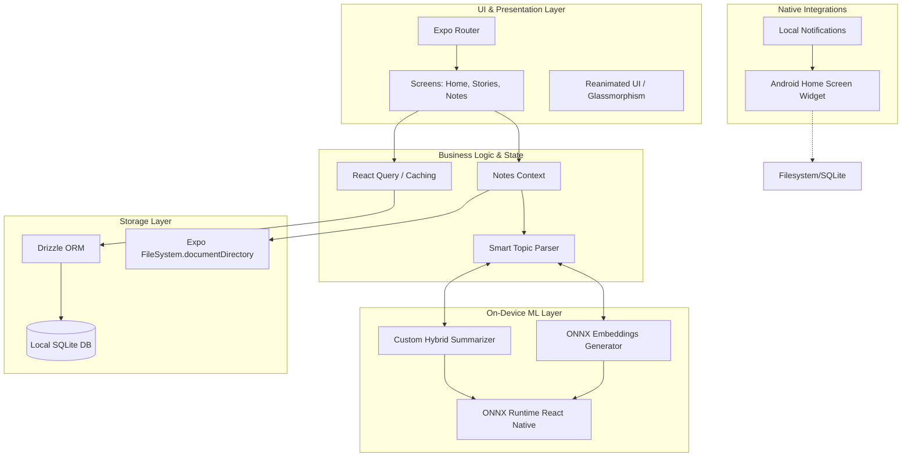

# System Architecture

This document provides a high-level overview of the architectural design decisions and data flows powering the **Daily Revision Hub**.

## Core Architecture Philosophy
The application follows an **Offline-First Edge-AI architecture**. All critical data processing, including natural language processing, embeddings generation, and database queries, happen directly on the user's device. 

### Why Offline-First Edge-AI?
1. **Privacy**: User notes are deeply personal. Processing them locally ensures no private text is transmitted over the network.
2. **Speed & Availability**: Instant topic extractions and summaries regardless of network connectivity.
3. **Cost Efficiency**: Eliminates the need for expensive cloud inference APIs.

---

## High-Level System Diagram

## Component Deep Dive

### 1. UI & Presentation Layer
- Built with **Expo Router** for file-based routing.
- Leverages `react-native-reanimated` for 60fps gesture-driven animations (e.g., swiping between story cards).
- Styled using custom glassmorphism components (`expo-blur`, `expo-glass-effect`) to give a modern, premium feel.

### 2. On-Device AI Engine (`lib/localSummarizer.ts`, `lib/onnxEmbeddings.ts`)
- Instead of relying on external cloud APIs or high-level transformer libraries, the app uses a **custom statistical/graph-based hybrid summarizer** for zero-latency processing.
- **ONNX Runtime** executes quantized `MiniLM` models directly on the device CPU/NPU.
- These local models are used to analyze long notes, cluster them into "Topics", and detect semantic boundaries for revision blocks.

### 3. Data Flow & Persistence (`lib/persistentStore.ts`)
- **Drizzle ORM** manages the local SQLite tables with strict TypeScript schemas.
- Extracted JSON artifacts and raw note texts are saved persistently to `FileSystem.documentDirectory` instead of `AsyncStorage` to avoid size limits and parse errors.
- **React Query** manages the asynchronous data state, ensuring the UI always reflects the latest database state without manually triggering re-renders everywhere.

### 4. Native Android Widget (`widget/`)
- A custom Kotlin-bridged widget built via `react-native-android-widget`.
- Operates independently from the main React Native thread to render the user's saved/bookmarked revision blocks directly on their home screen.
- Supports tap-to-deep-link targeting specific folders within the Expo app.
