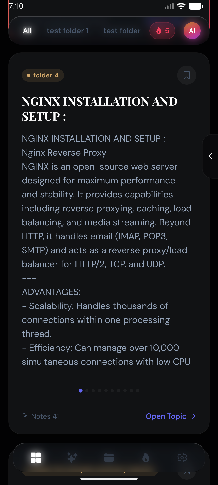
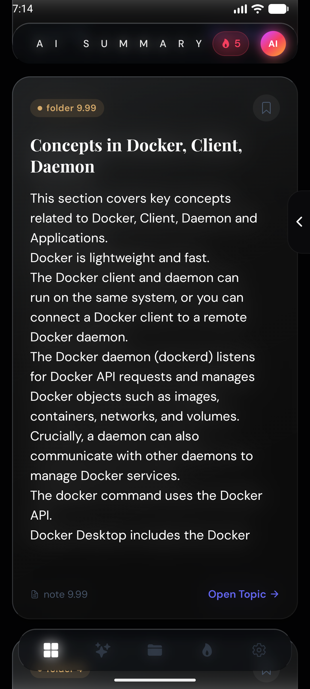
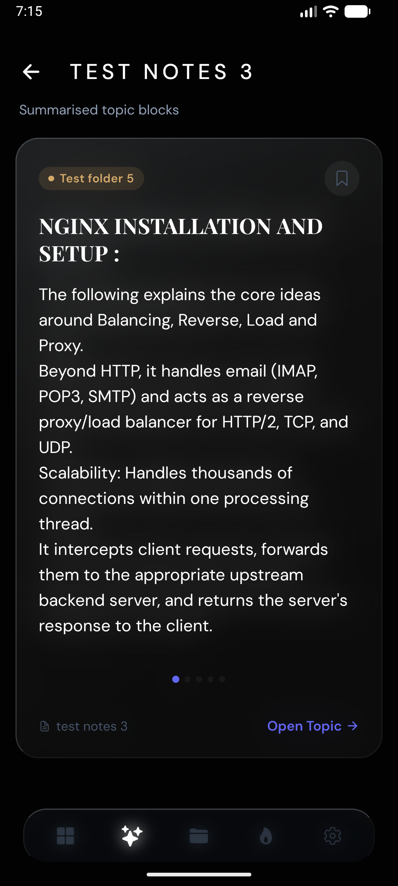
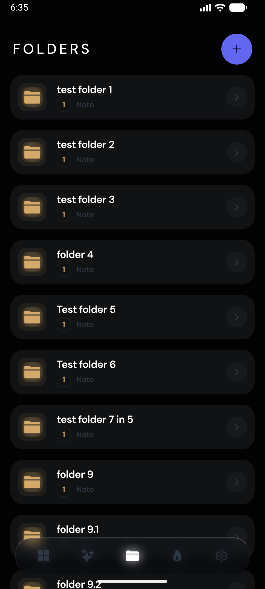
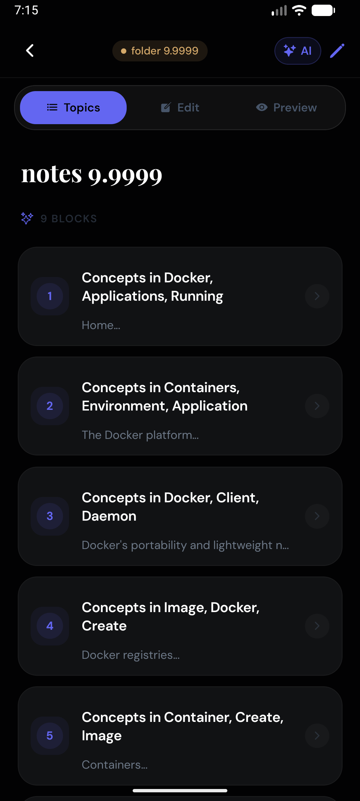
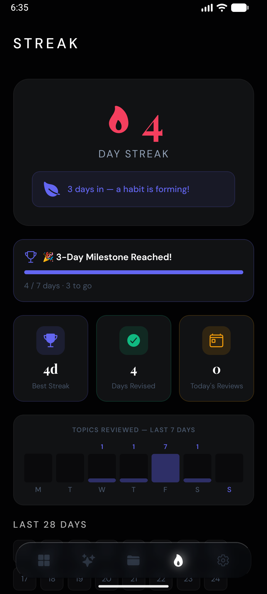
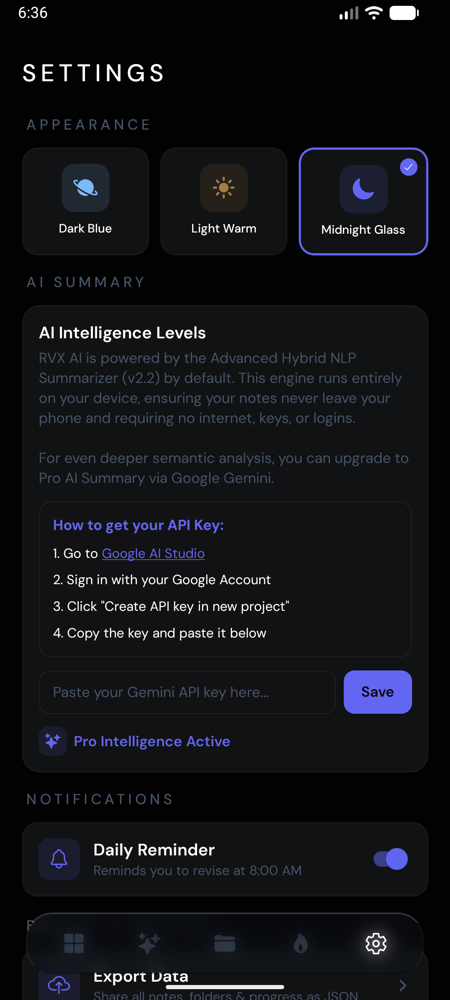
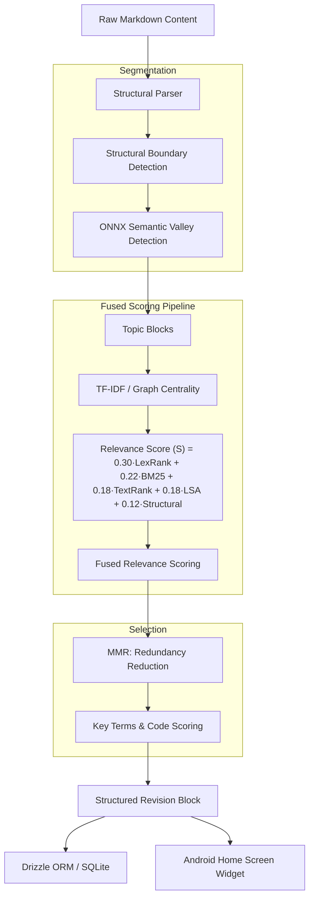
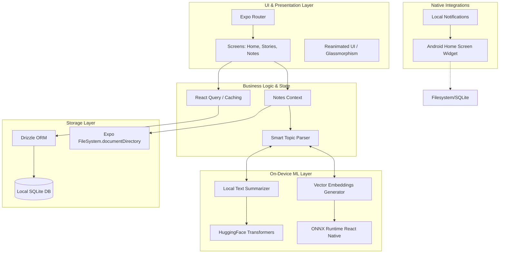

# Daily Revision Hub
**AI-Powered Offline-First Study & Revision Application**

A React Native (Expo) mobile application built to solve the friction of manual revision by pushing AI models directly to the edge. Using a **custom hybrid summarizer** and **ONNX Runtime**, it provides intelligent, adaptive study aids with **100% privacy** and **offline availability**.

*Note: This repository serves as a portfolio demonstration and architectural overview. The full source code is maintained in a private repository.*

## ✨ Feature Showcase

### 1. Smart Dashboard & Revision Feed
The central hub of the application. The **revision feed** intelligently surfaces note blocks that require attention. Using a liquid-glass aesthetic, the UI provides a distraction-free environment for focus.

  

Experience zero-latency AI. Utilizing a **proprietary hybrid summarizer** (BM25, LexRank, MMR) and **ONNX-driven embeddings**, the app processes your raw notes locally to generate concise, actionable study blocks.

  
  

### 3. Intelligent Organization & Topic Analysis
The app doesn't just store notes; it understands them. It automatically categorizes content into **Folders** and performs **Topic Analysis** to cluster related concepts together for deeper context.

  
  

### 4. Focused Note Revision
Every generated block allows for deep dives. The **Note View** renders complex Markdown and allows users to jump back into the full context of their original documents instantly.

  

### 5. Habit Building & Personalization
Stay consistent with **Daily Streaks** and progress tracking. The **Advanced Settings** enable deep customization of the on-device AI models, UI theme (Midnight Glass, etc.), and local data management.

  
  

---

## 🛠 Tech Stack
**Frontend (Mobile):**
- **React Native & Expo**: File-based routing with Expo Router.
- **Reanimated & Glassmorphism**: High-performance 60fps gestures and premium UI blurs.

**Edge AI Engine:**
- **Custom Hybrid Summarizer**: Proprietary implementation of LexRank, TextRank, and BM25 for offline text analysis.
- **ONNX Runtime**: High-performance on-device model execution for `MiniLM` embeddings.
- **Gemini 1.5/2.0**: Optional cloud-scale LLM analysis for deep multi-document synthesis.

**Persistence:**
- **Drizzle ORM**: Type-safe local SQLite interactions.
- **React Query**: Robust server-state and cache management.

---

## 🧠 System Architecture

This section provides a high-level overview of the architectural design decisions and data flows powering the **Daily Revision Hub**.

### Core Architecture Philosophy
The application follows an **Offline-First Edge-AI architecture**. All critical data processing, including natural language processing, embeddings generation, and database queries, happen directly on the user's device. 

**Why Offline-First Edge-AI?**
1. **Privacy**: User notes are deeply personal. Processing them locally ensures no private text is transmitted over the network.
2. **Speed & Availability**: Instant topic extractions and summaries regardless of network connectivity.
3. **Cost Efficiency**: Eliminates the need for expensive cloud inference APIs.

---

### High-Level AI & System Flow

The application utilizes a multi-layered AI pipeline that transitions from structural parsing to semantic analysis and redundant-aware summarization.

---

### High-Level System Diagram

### Component Deep Dive

**1. UI & Presentation Layer**
- Built with **Expo Router** for file-based routing.
- Leverages `react-native-reanimated` for 60fps gesture-driven animations (e.g., swiping between story cards).
- Styled using custom glassmorphism components (`expo-blur`, `expo-glass-effect`) to give a modern, premium feel.

**2. On-Device AI Engine (`lib/localSummarizer.ts`, `lib/onnxEmbeddings.ts`)**
- Instead of relying on heavy high-level libraries, the app uses a **custom statistical/graph-based hybrid summarizer** for zero-latency text processing.
- **Fused Scoring Agency**: Every sentence is ranked using a weighted linear combination of five signals:
  - **S = 0.30·LexRank + 0.22·BM25 + 0.18·TextRank + 0.18·LSA + 0.12·Structural**
- **ONNX Runtime** executes quantized `all-MiniLM-L6-v2` transformer models for embeddings, which are used to analyze long notes, cluster them into "Topics", and detect semantic boundaries.

**3. Data Flow & Persistence (`lib/persistentStore.ts`)**
- **Drizzle ORM** manages the local SQLite tables with strict TypeScript schemas.
- Extracted JSON artifacts and raw note texts are saved persistently to `FileSystem.documentDirectory` instead of `AsyncStorage` to avoid size limits and parse errors.
- **React Query** manages the asynchronous data state, ensuring the UI always reflects the latest database state without manually triggering re-renders everywhere.

**4. Native Android Widget (`widget/`)**
- A custom Kotlin-bridged widget built via `react-native-android-widget`.
- Operates independently from the main React Native thread to render the user's saved/bookmarked revision blocks directly on their home screen.
- Supports tap-to-deep-link targeting specific folders within the Expo app.

## 🔗 Contact & Links
- **LinkedIn**: [https://www.linkedin.com/in/varanasirahul/](https://www.linkedin.com/in/varanasirahul/)

---
*Created by Rahul Varanasi*

