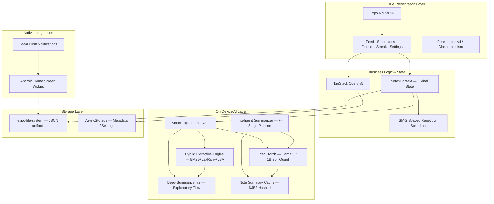
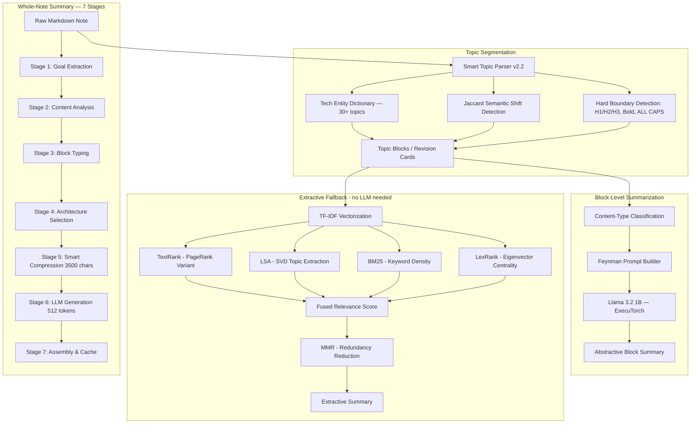

# RVX AI NOTES
**On-Device Generative AI Study & Revision Application**

A React Native (Expo) mobile application that runs a **local Llama 3.2 1B language model** directly on your phone via **ExecuTorch** — delivering intelligent, abstractive AI summaries with **100% privacy** and **zero internet dependency**.

*Note: This repository serves as a portfolio demonstration and architectural overview. The full source code is maintained in a private repository.*

---

## What Changed in v2

The AI engine was **completely rebuilt**. The previous ONNX Runtime / MiniLM embedding approach was replaced by a true on-device **generative LLM pipeline** using Meta's ExecuTorch inference runtime.

| Area | Before (v1) | After (v2) |
|---|---|---|
| **On-device AI** | ONNX Runtime + MiniLM embeddings | ExecuTorch + Llama 3.2 1B SpinQuant |
| **Summary type** | Extractive (sentence selection) | Abstractive (generated text) |
| **Model size** | ~23MB MiniLM | ~500–600MB Llama .pte |
| **Model download** | Bundled at install | Explicit user-initiated from Settings |
| **Summarization scope** | Per-block extractive | Per-block + whole-note generative |
| **Content awareness** | None | Feynman-style prompts per content type |

---

## Feature Overview

### 1. Intelligent Revision Feed
The central hub of the app. Notes are automatically split into **topic blocks** by a multi-signal semantic parser and surfaced in an algorithmic feed driven by **SM-2 Spaced Repetition** scheduling.

  
  

### 2. On-Device LLM Summaries (Llama 3.2 1B via ExecuTorch)
The app downloads and runs a quantized **Llama 3.2 1B SpinQuant** model locally on the device. No API key. No server. No data leaves the phone.

  

Summaries are **content-type aware** — the model receives a different Feynman-style prompt based on what it's reading:

| Content Type | Prompt Strategy |
|---|---|
| Theory / Concept | Analogy + Mechanism + Exam Tip + Recall cue |
| Command Reference | Command Cheat Sheet format |
| Tutorial / Steps | Step-by-step condensed summary |
| Code Reference | Code explanation with purpose |

### 3. Whole-Note AI Summary Tab
Beyond block-level cards, the **Summaries tab** generates one comprehensive, structured AI summary for an entire note — regardless of how many topic blocks it was split into.

A **7-stage pipeline** drives this:
1. Goal Extraction (detect note type)
2. Content Analysis (identify subjects & depth)
3. Block Typing (theory / code / procedural)
4. Architecture (choose output schema)
5. Compression (smart truncation, 3500 char context cap)
6. LLM Generation (512 max tokens, single call)
7. Assembly (validate, clean, return markdown)

Summaries are **cached on-disk** (DJB2 hash keyed per note ID + content hash) and reused until the note content changes.

### 4. Smart Topic Parser
The parser splits raw Markdown notes into revision blocks using multiple signals simultaneously:

- **Hard structural boundaries**: `#` headings, `**Bold**`-only lines, numbered items, ALL CAPS headings
- **Semantic shift detection**: Jaccard vocabulary overlap between adjacent paragraphs
- **Tech entity dictionary**: Recognizes 30+ tech topics (Docker, K8s, AWS, SQL, Git, etc.) — never merges different-subject blocks
- **Smart merge logic**: Fragments below word threshold are merged unless both start at a boundary
- **Inline splitting**: Handles dense single-line dumps pasted from ChatGPT

### 5. Organized Note Management

  
  

### 6. Habit Building & Streaks

  
  

---

## Technical Specifications

### Frontend (Mobile)
- **React Native & Expo SDK 54**: File-based routing via Expo Router v6
- **Reanimated v4 & Gesture Handler**: 60fps gesture-driven animations throughout
- **Glassmorphism UI**: `expo-blur` + `expo-glass-effect` for premium visual feel
- **Typography**: DM Sans + Playfair Display via Google Fonts

### On-Device Generative AI Engine
- **Model**: Llama 3.2 1B SpinQuant (`.pte` format, ~500–600MB)
- **Runtime**: ExecuTorch via `react-native-executorch ^0.8.3`
- **Download**: User-initiated from Settings; stored in device-local cache
- **Load time**: ~3–8 seconds into native memory after first download
- **Inference**: `temperature: 0.3`, `top-p: 0.9` for structured factual output
- **KV cache**: Stays small (~50–100MB) — fits in 2GB free RAM

### Extractive AI Fallback (Pure TypeScript, zero native deps)
When the LLM is unavailable, a custom hybrid engine runs in ~300–800ms:

$$S = 0.30 \cdot LexRank + 0.22 \cdot BM25 + 0.18 \cdot TextRank + 0.18 \cdot LSA + 0.12 \cdot Structural$$

- **LexRank**: Eigenvector centrality on TF-IDF cosine similarity graph
- **BM25**: Keyword density with document-length normalization
- **TextRank**: PageRank variant over sliding token windows
- **LSA**: SVD + Power Iteration for latent topic extraction
- **MMR**: Maximal Marginal Relevance for redundancy reduction
- **Code Importance Scoring**: Only high-signal code blocks surface in summaries

### Spaced Repetition Engine (SM-2)
Every topic block is scheduled using a custom SM-2 implementation:

$$EF' = \max(1.3, EF + (0.1 - (5-q) \cdot (0.08 + (5-q) \cdot 0.02)))$$

- User ratings: Easy / Good / Hard / Again
- **Interval progression**: 1 day → 6 days → `interval × EF`
- **Feed interleaving**: 1 "Hard" topic per 2 regular/due topics

### Persistence
- **FileSystem JSON** (`expo-file-system`): Primary store for notes, AI cache, topic splits — avoids AsyncStorage 2–6MB limits
- **AsyncStorage**: Fast-access metadata only (theme, streak, settings)
- **Atomic hashing**: DJB2 content hash checked before every write — prevents redundant AI compute

---

## Architectural Design

### High-Level System Diagram

### AI Pipeline Data Flow

---

## Removed in v2

The following components from v1 were **fully removed** and replaced:

| Removed | Replacement |
|---|---|
| `lib/onnxEmbeddings.ts` | `lib/llmSummarizer.ts` (ExecuTorch) |
| ONNX Runtime dependency | `react-native-executorch ^0.8.3` |
| `all-MiniLM-L6-v2` model (~23MB) | Llama 3.2 1B SpinQuant (~500–600MB) |
| Cosine similarity valley detection | Jaccard + entity dictionary (in smartTopicParser) |
| Semantic embedding boundary detection | Rule-based + statistical semantic shift |

---

## Contact Information

- **LinkedIn**: [https://www.linkedin.com/in/varanasirahul/](https://www.linkedin.com/in/varanasirahul/)
- **Email**: rahulvaranasi04@gmail.com

---

*Created by Rahul Varanasi — © 2026 All Rights Reserved*
